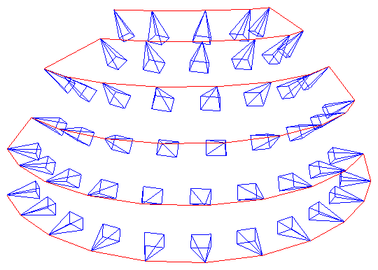
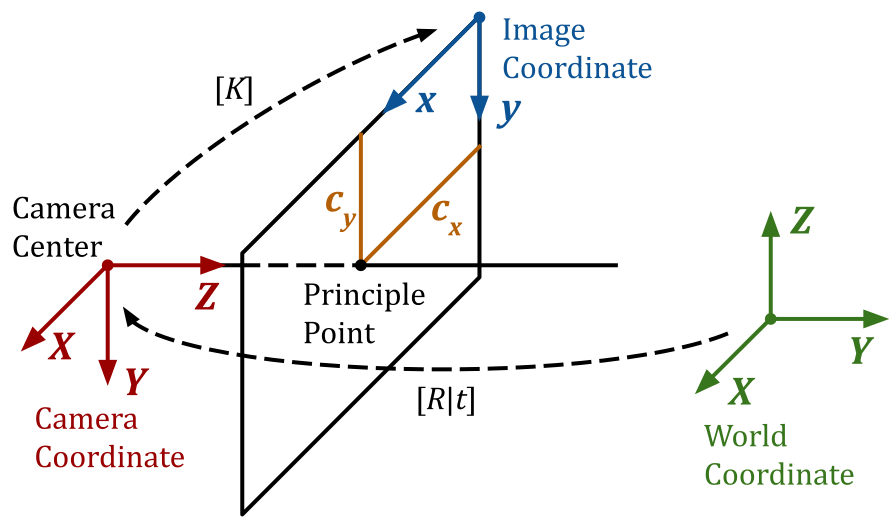

# CamTools: Camera Tools for Computer Vision

CamTools is a collection of tools for handling cameras in computer vision. It
can be used for plotting, converting, projecting, ray casting, and doing more
with camera parameters. It follows the standard camera coordinate system with
clear and easy-to-use APIs.

[](https://github.com/yxlao/camtools/actions/workflows/formatter.yml)
[](https://github.com/yxlao/camtools/actions/workflows/unit_test.yml)
[](https://github.com/yxlao/camtools/actions/workflows/pypi.yml)
[](https://github.com/yxlao/camtools)
[](https://gitee.com/yxlao/camtools)
[](https://pypi.org/project/camtools)

## What can you do with CamTools?

1. Plot cameras. Useful for debugging 3D reconstruction and NeRFs!

   ```python
   import camtools as ct
   import open3d as o3d
   cameras = ct.camera.create_camera_ray_frames(Ks, Ts)
   o3d.visualization.draw_geometries([cameras])
   ```

   <p align="center">
      
   </p>

2. Convert camera parameters.

   ```python
   pose = ct.convert.T_to_pose(T)     # Convert T to pose
   T    = ct.convert.pose_to_T(pose)  # Convert pose to T
   R, t = ct.convert.T_to_R_t(T)      # Convert T to R and t
   C    = ct.convert.pose_to_C(pose)  # Convert pose to camera center
   K, T = ct.convert.P_to_K_T(P)      # Decompose projection matrix P to K and T
                                      # And more...
   ```

3. Projection and ray casting.

   ```python
   # Project 3D points to pixels.
   pixels = ct.project.points_to_pixel(points, K, T)

   # Back-project depth image to 3D points.
   points = ct.project.im_depth_to_points(im_depth, K, T)

   # Ray cast a triangle mesh to depth image.
   im_depth = ct.raycast.mesh_to_depths(mesh, Ks, Ts, height, width)

   # And more...
   ```

4. Image and depth I/O with no surprises.

   Strict type checks and range checks are enforced. The image and depth I/O
   APIs are specifically designed to solve the following pain points:

   - Is my image of type `float32` or `uint8`?
   - Does it have range `[0, 1]` or `[0, 255]`?
   - Is it RGB or BGR?
   - Does my image have an alpha channel?
   - When saving depth image as integer-based `.png`, is it correctly scaled?

   ```python
   ct.io.imread()
   ct.io.imwrite()
   ct.io.imread_detph()
   ct.io.imwrite_depth()
   ```

5. Command-line tools `ct` (runs in terminal).

   ```bash
   # Crop image boarders.
   ct crop-boarders *.png --pad_pixel 10 --skip_cropped --same_crop

   # Draw synchronized bounding boxes interactively.
   ct draw-bboxes path/to/a.png path/to/b.png

   # For more command-line tools.
   ct --help
   ```

   <p align="center">
      
   </p>

6. And more.
   - Solve line intersections.
   - COLMAP tools.
   - Points normalization.
   - ...

## Installation

To install CamTools, simply do:

```bash
pip install camtools
```

Alternatively, you can install CamTools from source with one of the following
methods:

```bash
git clone https://github.com/yxlao/camtools.git
cd camtools

# Installation mode, if you want to use camtools only.
pip install .

# Dev mode, if you want to modify camtools on the fly.
pip install -e .

# Dev mode and dev dependencies, if you want to modify camtools and run tests.
pip install -e .[dev]
```

## Camera coordinate system

A homogeneous point `[X, Y, Z, 1]` in the world coordinate can be projected to a
homogeneous point `[x, y, 1]` in the image (pixel) coordinate using the
following equation:

$$
\lambda
\left[\begin{array}{l}
x \\
y \\
1
\end{array}\right]=\left[\begin{array}{ccc}
f_{x} & 0 & c_{x} \\
0 & f_{y} & c_{y} \\
0 & 0 & 1
\end{array}\right]\left[\begin{array}{llll}
R_{00} & R_{01} & R_{02} & t_{0} \\
R_{10} & R_{11} & R_{12} & t_{1} \\
R_{20} & R_{21} & R_{22} & t_{2}
\end{array}\right]\left[\begin{array}{c}
X \\
Y \\
Z \\
1
\end{array}\right].
$$

We follow the standard OpenCV-style camera coordinate system as shown below.

<p align="center">
   
</p>

- **Camera coordinate:** right-handed, with $Z$ pointing away from the camera
  towards the view direction and $Y$ axis pointing down. Note that the OpenCV
  convention (camtools' default) is different from the OpenGL/Blender
  convention, where $Z$ points towards the opposite view direction and the $Y$
  axis points up. To convert between the OpenCV camera coordinates and the
  OpenGL-style coordinates, use the conversion functions such as
  `ct.convert.T_opencv_to_opengl()`, `ct.convert.T_opengl_to_opencv()`,
  `ct.convert.pose_opencv_to_opengl()`, and
  `ct.convert.pose_opengl_to_opencv()`, etc.
- **Image coordinate:** starts from the top-left corner of the image, with $x$
  pointing right (corresponding to the image width) and $y$ pointing down
  (corresponding to the image height). This is consistent with OpenCV. Pay
  attention that the 0th dimension in the image array is the height (i.e., $y$)
  and the 1st dimension is the width (i.e., $x$). That is:
  - $x$ <=> $u$ <=> width <=> column <=> the 1st dimension
  - $y$ <=> $v$ <=> height <=> row <=> the 0th dimension
- `K`: `(3, 3)` camera intrinsic matrix.
  ```python
  K = [[fx,  s, cx],
       [ 0, fy, cy],
       [ 0,  0,  1]]
  ```
- `T` or `W2C`: `(4, 4)` camera extrinsic matrix.
  ```python
  T = [[R  | t   = [[R00, R01, R02, t0],
        0  | 1]]    [R10, R11, R12, t1],
                    [R20, R21, R22, t2],
                    [  0,   0,   0,  1]]
  ```
  - `T` is also known as the world-to-camera `W2C` matrix, which transforms a
    point in the world coordinate to the camera coordinate.
  - `T`'s shape is `(4, 4)`, not `(3, 4)`.
  - `T` is the inverse of `pose`, i.e., `np.linalg.inv(T) == pose`.
  - The camera center `C` in world coordinate is projected to `[0, 0, 0, 1]` in
    camera coordinate.
- `R`: `(3, 3)` rotation matrix.
  ```python
  R = T[:3, :3]
  ```
  - `R` is a rotation matrix. It is an orthogonal matrix with determinant 1, as
    rotations preserve volume and orientation.
    - `R.T == np.linalg.inv(R)`
    - `np.linalg.norm(R @ x) == np.linalg.norm(x)`, where `x` is a `(3,)`
      vector.
- `t`: `(3,)` translation vector.
  ```python
  t = T[:3, 3]
  ```
  - `t`'s shape is `(3,)`, not `(3, 1)`.
- `pose` or `C2W`: `(4, 4)` camera pose matrix. It is the inverse of `T`.
  - `pose` is also known as the camera-to-world `C2W` matrix, which transforms a
    point in the camera coordinate to the world coordinate.
  - `pose` is the inverse of `T`, i.e., `pose == np.linalg.inv(T)`.
- `C`: camera center.
  ```python
  C = pose[:3, 3]
  ```
  - `C`'s shape is `(3,)`, not `(3, 1)`.
  - `C` is the camera center in world coordinate. It is also the translation
    vector of `pose`.
- `P`: `(3, 4)` the camera projection matrix.
  - `P` is the world-to-pixel projection matrix, which projects a point in the
    homogeneous world coordinate to the homogeneous pixel coordinate.
  - `P` is the product of the intrinsic and extrinsic parameters.
    ```python
    # P = K @ [R | t]
    P = K @ np.hstack([R, t[:, None]])
    ```
  - `P`'s shape is `(3, 4)`, not `(4, 4)`.
  - It is possible to decompose `P` into intrinsic and extrinsic matrices by QR
    decomposition.
  - Don't confuse `P` with `pose`. Don't confuse `P` with `T`.
- For more details, please refer to the following blog posts:
  [part 1](https://ksimek.github.io/2012/08/14/decompose/),
  [part 2](https://ksimek.github.io/2012/08/22/extrinsic/),
  and [part 3](https://ksimek.github.io/2013/08/13/intrinsic/).

## Future works

- Refined APIs.
- Full PyTorch/Numpy compatibility.
- Unit tests.
